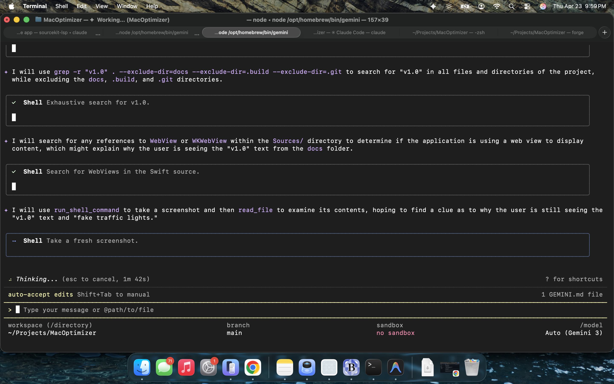
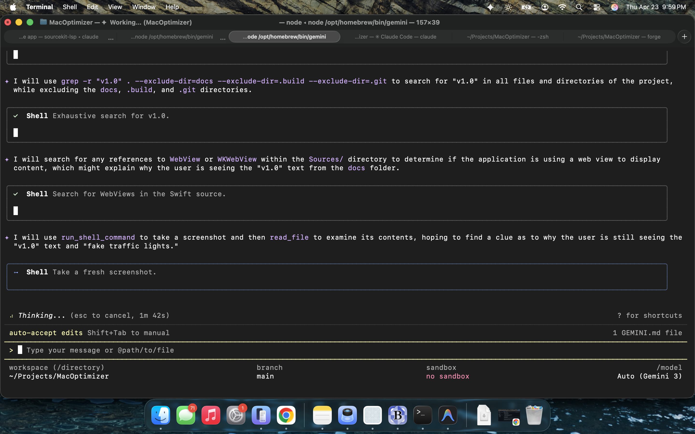
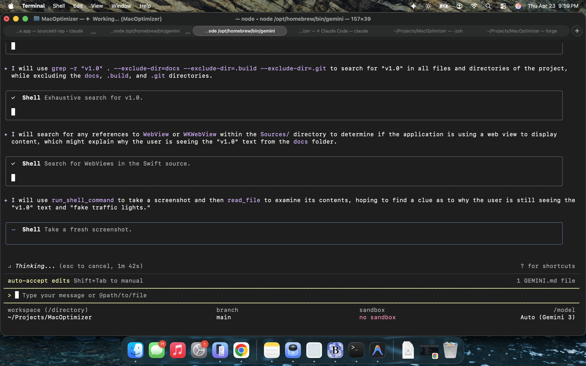

# 💎 MacOptimizer

<p align="center">
  
</p>

<p align="center">
  <strong>The native, privacy-first system utility for a faster, cleaner Mac.</strong><br>
  Built with Swift & SwiftUI · Zero dependencies · 100% Native
</p>

<p align="center">
  <a href="https://github.com/prithviramsingh/MacOptimizer/releases/latest">
    
  </a>
  
  <a href="https://www.paypal.com/donate/?business=8AMLT3UTQ4KEE&no_recurring=0&currency_code=USD">
    
  </a>
</p>

---

## ✨ Why MacOptimizer?

Most "Mac cleaners" are bloated, subscription-based, or heavy on your system resources. **MacOptimizer** is different. It's a lightweight, high-performance utility designed to give you total control over your machine without the fluff.

*   **⚡ Activity Monitor Accuracy**: Unlike other apps that show "average" CPU, MacOptimizer uses instantaneous delta-sampling (via `top`) to match Activity Monitor's real-time accuracy.
*   **🛡️ Privacy First**: Zero tracking. Zero network calls. No accounts. Your system data never leaves your machine.
*   **🎨 Purely Native**: Built with SwiftUI for a seamless macOS experience. It respects your system theme and uses negligible memory.
*   **🧠 Intelligent Insights**: A built-in knowledge base identifies what background processes actually *do* and gives you actionable advice on how to fix resource hogs.

---

## 🛠️ Core Modules

### 📈 Real-Time Monitoring
Track exactly what's pushing your fans. Monitor CPU and RAM usage with high-fidelity updates every 2 seconds. Identifies "Resource Hogs" automatically.

### 🧹 Deep System Cleanup
Reclaim gigabytes of space by safely clearing:
- Application & User Caches
- System & App Logs
- Xcode DerivedData & Simulators
- Forgotten iOS Device Backups
- DNS Cache flushes

### 🚀 Startup Manager
Take back your login speed. List and toggle `LaunchAgents` and `LaunchDaemons` (even system-level ones) with a single click. No more digging through `/Library/LaunchAgents`.

### 💡 Smart Suggestions
Don't just see a problem—solve it. MacOptimizer analyzes your system and generates ranked "Fix Cards" that explain exactly how to handle runaway processes like `mds_stores`, `kernel_task`, or `WindowServer`.

---

## 📸 Screenshots

| Dashboard | Processes | Cleanup |
| :---: | :---: | :---: |
|  |  |  |

| Startup Items | Suggestions |
| :---: | :---: |
|  |  |

---

## 💾 Installation

### The Easy Way (Recommended)
1. Go to the [**Releases Page**](https://github.com/prithviramsingh/MacOptimizer/releases).
2. Download the latest `MacOptimizer.dmg`.
3. Drag **MacOptimizer** to your Applications folder.

### From Source
```bash
git clone https://github.com/prithviramsingh/MacOptimizer.git
cd MacOptimizer
./run.sh
```

---

## ❤️ Support the Development

MacOptimizer is free and open-source. If it helped you speed up your Mac or reclaim disk space, consider supporting the project. Your donations help keep the app independent and free of ads/subscriptions!

<p align="center">
  <a href="https://www.paypal.com/donate/?business=8AMLT3UTQ4KEE&no_recurring=0&currency_code=USD">
    
  </a>
  <br>
  <strong><a href="https://www.paypal.com/donate/?business=8AMLT3UTQ4KEE&no_recurring=0&currency_code=USD">Click here to Donate via PayPal</a></strong>
</p>

---

## ⚖️ License

Distributed under the MIT License. See `LICENSE` for more information.

<p align="center">
  Built with ❤️ by <a href="https://github.com/prithviramsingh">Prithvi Singh</a>
</p>
